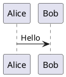

# 常用 Markdown 语法速查

标准 Markdown 的部分在任何平台都能用，最后一节「本站扩展」是这套主题额外支持的语法。

## 标题

```markdown
# 一级标题
## 二级标题
### 三级标题
###### 六级标题
```

`#` 后面必须有一个空格。正文里建议从 `##` 开始，`#` 留给文章标题本身。所有标题会自动生成锚点，鼠标悬停时出现 `#`，可以复制链接。

## 段落与换行

**空一行**才是新段落。只敲一次回车，渲染时仍然是同一段。

需要强制换行时，在行尾留**两个空格**再回车，或者直接写 `<br>`（本站允许内嵌 HTML）。

## 强调

```markdown
**粗体**
*斜体*
***粗斜体***
~~删除线~~
```

删除线属于 GFM 扩展，本站已启用。

## 列表

```markdown
- 无序列表
- 第二项

1. 有序列表
2. 第二项
   - 缩进两个空格可以嵌套
```

任务列表（GFM）：

```markdown
- [x] 已经做完的事
- [ ] 还没做的事
```

列表前后记得留空行，否则容易和上一段粘在一起。

## 引用

```markdown
> 第一层引用
>
> > 嵌套引用
```

引用里可以放列表、代码、图片等任何块级内容。

## 链接与图片

```markdown
[链接文字](https://example.com)
[带提示的链接](https://example.com "悬停显示的文字")


```

- 站外链接会自动带上 `target="_blank"` 和 `rel="nofollow noopener noreferrer"`。
- 图片写相对路径 `./cover.webp` 时，从**当前文章所在目录**解析；写 `/images/a.webp` 则从 `public/` 目录解析，也可以直接用完整的 `https://` 地址。
- 图片 alt 里加上 `w-75%` 可以把宽度设成 1%–100% 并居中：

```markdown

```

## 代码

行内代码用反引号包裹：

```markdown
配置项是 `siteURL`，注意结尾要有斜杠。
```

多行代码用围栏，并在开头注明语言以启用高亮：

````markdown
```javascript
const a = 1;
```
````

本站的代码块由 Expressive Code 渲染：语法高亮和行号默认就有，语言标签显示在右上角（代码块一旦用了 `title`，标签就不再显示）。标题和行标记写在**语言后面的元信息**里：

````markdown
```javascript title="demo.js" ins={2} del={3} mark={5}
const a = 1;
const b = 2;
const c = 3;
const d = 4;
const e = 5;
```
````

- `ins={2}` 标成新增（绿色），`del={3}` 标成删除（红色），`mark={5}` 高亮。
- 支持范围写法：`ins={2-4}`。
- **行标记不能写在注释里。** 写成 `const a = 1; // ins={2}` 只会被当成一行普通注释，什么都不会发生。

达到 **20 行**的代码块会自动折叠，默认只露出前 10 行，右上角有展开按钮。

## 表格

```markdown
| 左对齐 | 居中 | 右对齐 |
| :----- | :--: | -----: |
| A      |  B   |      C |
```

第二行的 `:---` 决定对齐方式。表格过宽时本站会自动加横向滚动容器。

## 分隔线

```markdown
---
```

三个或更多 `-`、`*`、`_` 都行。注意 `---` 前面必须空行，否则会被当成上一行的标题下划线。

## 脚注

```markdown
这句话有个脚注[^1]。

[^1]: 脚注内容写在这里。
```

## 转义与 HTML

想显示 Markdown 符号本身，用反斜杠转义：

```markdown
\*不是斜体\*
\[不是链接\]
```

表格单元格里的竖线也要转义成 `\|`。

本站允许直接写 HTML，比如 `<br>`、`<kbd>Ctrl</kbd>`、`<mark>高亮</mark>`。

## 手动摘要

列表页和卡片默认抓正文第一段当摘要。想自己指定截断位置，在正文里**单独占一行**写 `<!-- more -->`：

```markdown
这一段会出现在列表页的摘要里。

<!-- more -->

这一段只有点进文章才看得到。
```

---

## 本站扩展语法

以下几节是这套博客主题独有的，换到别的平台不一定生效。

### 提示块

~~~markdown
:::note[可选标题]
普通提示。
:::

:::warning{title="请注意"}
另一种写标题的方式。
:::
~~~

可用的主类型：`note`、`tip`、`important`、`warning`、`caution`。

常见别名会映射到最接近的样式：`info` / `abstract` / `summary` / `todo` / `example` / `quote` → `note`；`hint` / `success` / `check` / `done` → `tip`；`question` / `help` / `faq` → `important`；`attention` → `warning`；`failure` / `fail` / `missing` / `danger` / `error` / `bug` → `caution`。

**起始和结尾的 `:::` 必须成对**，漏掉结尾会把后面的正文整段吞进提示块。

也支持 GitHub 写法：

```markdown
> [!NOTE]
> 这是一个信息提示。

> [!WARNING]
> 这是一个警告。
```

### 数学公式

行内用 `$...$`，独立成行用 `$$...$$`，由 KaTeX 渲染：

```markdown
质能方程是 $E = mc^2$。

$$
\int_{0}^{1} x^2 \, dx = \frac{1}{3}
$$
```

### 图表

Mermaid：

````markdown

````

PlantUML：

````markdown

````

> [!WARNING]
> PlantUML 源码会被编码进图片 URL，发送到公共服务器渲染。**不要在图表里写密码、Token 或任何个人信息**，需要保密就关掉这个功能或自建服务器。

### 图片网格

默认情况下，连续两张以上的纯图片段落会自动排成网格（最多 4 列）。需要精确控制时用 `:::grid`：

~~~markdown
:::grid{columns="3" aspect="16/9" fit="cover"}


:::
~~~

`columns` 取 1–6，`aspect` 是正数比例，`fit` 为 `cover`（裁剪填满）或 `contain`（完整显示）。每个网格是独立的灯箱分组，点击图片放大时不会串到别的网格。

### 站内互链

```markdown
[[guides/getting-started]]
[[guides/getting-started#installation|阅读安装章节]]
```

路径相对于 `src/content/posts/`，不带扩展名。**单独占一行**会渲染成文章卡片，写在句子中间则是普通链接。

### GitHub 卡片

```markdown
::github{repo="withastro/astro"}
```

### 折叠文字

```markdown
答案是 :spoiler[在这里]。
```

Spoiler 只是视觉遮罩，查看源代码就能看到原文，**不要当保密手段用**。真正需要密码保护请用 frontmatter 的文章加密字段。

---

## 容易踩的坑

1. **表格必须有分隔行。** 只写表头和数据行不会渲染成表格。
2. **列表前后留空行。** 紧贴段落会导致整块被当成段落文字。
3. **提示块要闭合。** `:::` 少一个，后面的内容全部消失进提示块。
4. **行尾两个空格才有硬换行**，而且编辑器里看不出来，容易在格式化时被吃掉。优先用 `<br>`。
5. **智能标点已开启**（smartypants）：英文引号会变成弯引号，`--` 变成 –，`...` 变成 …。写代码或需要精确字符时请放进代码块。
6. **比例不用转义。** 正文里写 `3:4`、`16:9` 是安全的，主题会先做转义处理再交给 Markdown 解析；但请注意这个规则不作用于代码块。
7. **图片路径区分大小写**，部署到 Vercel（Linux）后 `Cover.webp` 和 `cover.webp` 是两张不同的图。
8. **图片不存在会让整个页面报错。** 相对路径是真实解析的，写错文件名或漏放图片时页面直接报 `ImageNotFound`，而不是显示一张裂图——本地预览打不开时先查图片。
9. **行标记写在元信息里，不是注释里。** 见上面「代码」一节。

---

参考：[内容编写指南](./CONTENT_AUTHORING.zh.md) 是主题官方的字段与语法说明，frontmatter 的完整字段表在那里。
